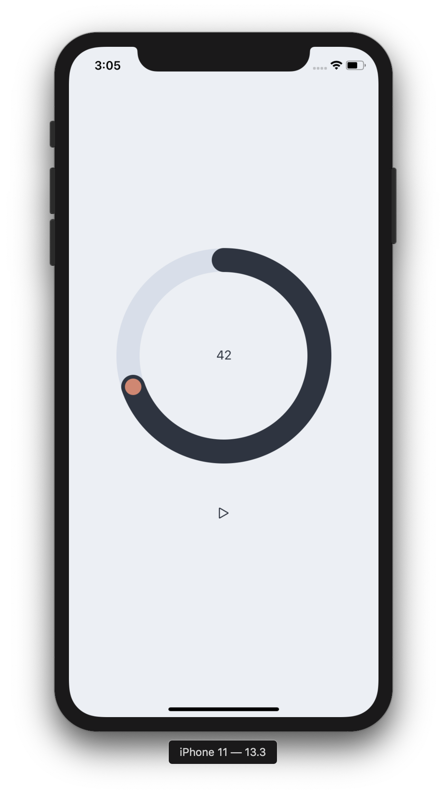

# No
A Meditation app that wont steal your watch and sell it back to you

> “Meditation is the discovery that the point of life is always arrived at in the immediate moment. And therefore, if you meditate for an ulterior motive — that is to say, to improve your mind, to improve your character, to be more efficient in life — you’ve got your eye on the future and you are not meditating!” - Alan Watts

## Sounds
http://soundbible.com/1496-Japanese-Temple-Bell-Small.html
